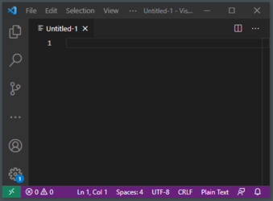

% Welcome to APSU Web Development Camp
% Sponsored by GOOGLE!

# Introduction

## Welcome to the APSU Camp on Web Development.

In this camp, we will learn the following.

- HTML is used to create websites.
- CSS is used to style websites.
- Basic computer literacy.
- Maybe enough to think about a career in computer IT.
- Try to have some fun in the process.

## The stuff we teach you

- The stuff we teach you in this camp is used by real IT professionals.

. . .

- Really. We wanted this camp to be real-world skills and literacy.

# Programming

## Let's talk about the tools of Programming for the Web

You really only need two pieces of software to write code for the web.

- A web browser.
- A text editor.

## Web Browsers

What are some web browsers? This is software used to browse the World Wide Web.

. . .

- Google Chrome
- Microsoft Edge
- Mozilla Firefox
- Apple Safari
- And more!

Most browsers are free! Which one is your favorite? Is there one that we didn't mention?

## Text Editors

A text editor is software used to write code. It saves text to files without any formatting (so software like Microsoft Word won't make for a good text editor). Does anyone know of text editors?

. . .

- Notepad for Windows! (This is already installed on every version of Windows.)
- Notepad++ is a free download for Windows.
- Brackets is a free download for Mac.
- Visual Studio Code is a free download for Windows and Mac.

## Which one should I download?

If you use a Mac, we recommend that you download Brackets or Visual Studio Code. If you use Windows, we recommend that you download Visual Studio Code. Not every text editor is free, but the ones we list are free!

# The Internet

## Let's talk about the Internet

- Your computer has an address that is either assigned to you by your Internet Service Provider or the router to which you are connected.
- Your ISP is your Internet Service Provider.
- A **server** houses files and also has an IP address somewhere else in the world. Often, it will have a domain name, such as "google.com".

## So how does the Web work?

It's pretty simple to explain. Simple is good! If you are on the internet, you are connected to an Internet Service Provider.

1. You type a website address or click a link. (Links contain addresses.)
2. This tells the Internet Service Provider to go find the **server** for your address. 
3. The server then looks for a file containing the desired content.
4. The server sends the desired content back to your Internet Service Provider.
5. The Internet Service Provider sends the content to your computer.
6. The web browser figures out how to display the content on your screen.

## What is HTTP and HTML?

There are a lot of terms used on the Internet that you only know of by letters.

- HTTP stands for Hypertext Transfer Protocol.
    - Hypertext Transfer Protocol is the instructions needed to send a file from one computer to another over the web.
- HTML stands for Hypertext Markup Language.
    - Hypertext Markup Language is the programming language used to design websites, which is why you are here!

In short, you use HTTP to send HTML files over the WWW.

## The Three Main Technologies of the Web

- HTML5 is the language that specifies the content of the web page.
- CSS stands for Cascading Style Sheets. It's used to specify the style (color, font sizes, placement) of an HTML page.
- JavaScript is the language for interactive websites. People have created amazing games entirely in JavaScript.

Each of these three technologies are represented with different programming languages. Your web browser understands all three.

# An Introduction to HTML5

## Text Editors

A **text editor** is a common tool that programmers use. A tool, like a hammer or a drill, is one that should be cared for and learned. You can whack your thumb with a hammer and you can accidentally wipe out files with a text editor. It's pretty important that you get to know the features of your text editor.

## Text Editors

Let's take a look at Visual Studio Code.

## Text Editors

The first thing I do is create a new file and save it. Click on "File" and "New File".

## Text Editors

Our file is called "Untitled," which is a poor name for a file. Let's fix that.

## Text Editors

Click on "File" and "Save As".

## Text Editors

When you save a file, select the Desktop and name it "index.html".

## Why index.html?

- Software recognizes files by their extension.
- Think of file names as a "Given name" and a "Family name."
- Think of "index" is the given name. You can name a file whatever you like, but let's name this file "index".
- Think of "html" as the family name. This is also called the "extension."
- Make sure you put a period between the two names.
- Your browser will know this is an HTML file by the extension "html".

## One more thing.

- Never

. . .

- ever,

. . .

- Ever,

. . .

- EVER,

. . .

- **EVER**

. . .

- put spaces in your filenames.

Thank you.

## Text Editors

When you save a file, select the Desktop and name it "index.html".

## HTML5

HTML5 stands for Hyper Text Markup Language Version 5.

The first line in every HTML5 document is the DOCTYPE line. It looks like this:

    <!DOCTYPE html>

Go ahead and type it in.

## HTML5

When you are done, your screen will look like this. This code is not saved.

## HTML5

Once you save, it will look like this. Can you spot the difference between these two photos?

## More Code

From here on out, we are typing up our code together. You won't see screenshots.

## Next code.

Type up our two new lines of code. I've included the first line which you should already have.

    <!DOCTYPE html>

    <html lang="en">

    </html>

All code will go between the two new lines that you just added. The last line of every html file should be "</html>".

