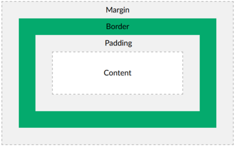

% Day 2 on HTML and CSS
% Sponsored by GOOGLE!

# Review

## Let's review

What did we talk about in the last class?

- What is the tool that we use for programming?
- Should we use spaces in our file names?

## All of the tags we learned.

!DOCTYPE html head meta title body h1 h2 h3 h4 h5 h6 p img

## Let's code a fresh website from scratch.

Let's build a complete website using most of what we learned yesterday. Make sure your page uses at least one image.

## Play the video on Internet Safety

. . .

What did you think?

## My take-aways

- Oversharing on social media.
    - Don't let people take advantage of you because of the things you share by being selective about what you share.
    - Don't share things about people you know without their consent.
- Turn off accounts which you don't care about.
    - You aren't obligated to follow anyone and no one is obligated to follow you.
- Don't compare your hidden life to another person's highlight reel.
    - In other words, everyone has flaws so don't worry about it when other people seem flawless.
- Finally, computer-related addictions is real, so know when to walk away when it is too much.
    - People with addictions aren't bad. They just need a little help.
# More Features of HTML

## Let's Link!

A link on a website contains an address to another web page. The official term for a link is an **anchor**. The tag to create an **anchor** is `<a>`. Let's create a link to Google on our website:

    <a href="http://www.google.com">
       Google
    </a>

What is **href**? An **href** is a **hypertext reference** and is a fancy way of saying an address. After the `<a>` tag, you must type what you want the link to look like and you must end it with `</a>`.

## You practice.

Add some more links to your website.

- Create a link to your favorite website.
- Create a link to Austin Peay! http://apsu.edu
- Create a link to a site about your favorite movie, band, or book using an image. This will require you to find an image (use Unsplash!) and display it on your page and then write the `<a>` tag with the proper **href** around the image.

## Putting an image in a link

Here's the code for image that will take you to google.com. This example assumes we have a file named "google.png".

    

## Lists

HTML lists allow web developers to group a set of related items in lists. Lists come in two varieties. The first is unordered lists.

- Unordered
- Using
- Bullet points

## Lists

The second type of list is an ordered list.

1. Ordered
2. Using
3. Numbers

See how the two lists are different? We use unordered lists when we want to group things and not care about their order (like a shopping list) and we use ordered list to rank things (like steps in a cooking recipe or rank fastest runners).

## Pop Quiz

Pop quiz: What letters of the alphabet do "unordered list" and "ordered list" begin with?

## Unordered lists

Unordered list should be used for information which can be rearranged into any order. The tag for creating an unordered list is **ul** (for "unordered list").                                           
    
Here are my favorite colors.

    <ul>
        <li>orange</li>
        <li>purple</li>
        <li>green</li>
    </ul>

You'll notice that each element in the list is organized using the "li" tag (for "list item"). This will render using bullet points.

## Ordered lists

Ordered lists should be used for information which should be presented in a specific order. The tag for creating an ordered list is **ol** (for "ordered list").

    
Here are the classifications of student

    <ol>
        <li>freshman</li>
        <li>sophomore</li>
        <li>junior</li>
        <li>senior</li>
    </ol>

Like unordered lists, each element in the list should use the "li" tag. This will render using numbers, starting with 1.

## Coding Time

1. Create an unordered list of five foods that you enjoy eating.
2. Create an ordered list of your top five favorite movies.

In both lists, make sure each list item begins with `<li>` and ends with `</li>`. Make sure the beginning of each list is either `<ul>` or `<ol>` and make sure each list ends with the proper closing tag.

# Styling our page with CSS

## Styling our page with CSS

Our page looks ugly. There are only two colors. The images are misshappen. We need to style our page. We style with CSS. CSS is a different language from HTML, so it will take some getting use to. We need to add the `link` tag to our `head` tag:

    <head>
        <meta charset="utf-8">
        <title>Cute Animal Pictures</title>
        <link rel="stylesheet" href="style.css">
    </head>

See that part that references the file `style.css`? We need to make this file. You can do this easily in Visual Studio Code by holding the CTRL button and clicking on the "style.css" that you just typed. VS Code will ask you if you wish to make the file.

## What is style and content?

Content is anything you read or look at for the purpose of gaining information. Style covers how the content is displayed. Style covers...

- Color
- Size
- Position
- Border
- And so much more!

## How do you know what to style?

It is helpful to know what you can style.

- You can style the **body** tag and any tag inside the **body** tag.
- You can style any category (aka "class") of elements.
- You can style any single element (aka "id") by name.
- You can even style based on how the user interacts with your page.

## Change our site's background color.

We are now working with the file `style.css` and because of that, we write in a new language: CSS. Type this:

    body {
        background: green;
    }

Save all of your files and reload your page. If you don't like the color, try a different color name. CSS understands several common color names and even some interesting ones like **coral**, **olive**, and **tomato**! Is tomato a color? In CSS, tomato is a color!

## Practice Time

Perform a Google search for "HTML color names" to find a full list.

Try at least three colors before moving on.

Also: don't forget your semicolons!

## Let's change the foreground color.

If the background color is changed with "background," what do you think changes the foreground color? Surprise! It's just "color."

    body {
        background: green;
        color: tomato;
    }

Save your files and reload your page. Don't forget the semicolons! We have to admit that tomato on green is a really bad color combination. Change this to something that looks nicer.

## Changing an image size.

How many images do you have on your page? You'll need at least three. I want you to have at least two images of one type and a third image that will be excluded (for example, two animals and one car). Take a moment to add images to your page until you have at least three. If you need help, raise your hand.

## Changing an image size.

You can control all images using the `img` selector. Put this into your CSS file. We're going to take this out after we show that it works.

    img {
        width: 300px;
    }

This will cause all images to show up as 300 screen pixels wide. This causes some images to get smaller and other images to be larger. After you see that it works, take this out. Remove it and save the file.

## Changing an image size

Let's return to the cool cat image. You can name any element in HTML using an `id` attribute. Let's do this. Back in your `index.html` file, find an image an name it using the "id" attribute.

    

This image is now officially named "coolcat". Remember: names are case-sensitive, meaning that "coolcat" is different from "CoolCat" and "COOLCAT". Also, you can't use spaces in your names!

## Resizing "coolcat"

To resize a named element, we put the "#" symbol in front of the name in our CSS file.

    #coolcat {
        width: 300px;
    }

Now, the "coolcat" image is 300 screen pixels wide, but every other image is the original size. CSS IDs begin with a number sign (aka the pound sign, aka the hashtag symbol, aka the tik-tac-toe board).

## Classes

A "class" in CSS is your own group of elements. For example, my document has both animal and non-animal pictures. Pick an type of image content in which you have multiple of in your document. I'm going to pick "animal". For each animal picture in my document, I'm going to add a class.

    
    

I've added `class="animal"` to every image which contains an animal.

## Let's modify the class

Return to your style.css file. To modify a class, we put a "." (a period) followed by the name of the class. Let's add a border around each of our selected elements.

    .animal {
        border: 10px solid blue;
    }

Here, change "animal" to the class that you created. CSS classes begin with periods. Load your web page again.

# The Box Model

## The Box Model

Here's the secret to web design: Everything in HTML is treated as if it were a rectangle. Web designers called them "boxes."

- That image? A rectangle. (Obviously)
- That paragraph? A rectangle.
- That heading? A rectangle.

Browse any website and you'll discover that everything is a box.

## Thinking in Boxes

All content in web design is organized into four parts:

1. The content itself.
2. The padding is the distance between the content and the border.
3. The border is the visible border that you can draw around the content.
4. The margin is the distance between the border and the larger container for this content.

## Thinking in Boxes

## Content

You can control the size of the information (as we've already seen) There are a few ways to do this:

    width: 300px; /* The box is 300 pixels wide. */
    width: 50%;   /* The box is 50% of the screen. */

The first line resizes an image to an explicit width, but the second line resizes the image based on the size of the screen. Knowing which one to use at any moment takes experience.

## Content

Let's do a little demonstration. Change one of your images with a set width to this:

    width: 50%;

Save and reload your page. Now, resize the browser with your mouse. Watch how the image changes size based on your mouse pointer. Once you've done that, set the width to "300px" and see how the browser responds.

## Padding

Padding is the area between the content and it's border. The padding is always invisible. We can add this to our animal class:

    .animal {
        border: 10px solid blue;
        padding: 10px;
    }

This adds a 3 pixel padding between the content and the blue border.

## Border

Border, by default, is invisible, but you can change that. On our animal class, we have a 10 pixel solid blue border, but there are many other types.

    border: 10px dotted blue;
    border: 10px dashed blue;
    border: 10px double blue;
    border: 10px groove blue;
    border: 10px ridge blue;
    border: 10px inset blue;
    border: 10px outset blue;

As always, we want you to try three different border styles before moving on. Find one that you think looks the nicest.

## Margin

The margin is the area between the border and whatever contains this content. This sets the margin in all 4 directions ouside the box.

    .animal {
        border: 10px solid blue;
        padding: 3px;
        margin: 3px; /* Add this line. */
    }

Add this line to your unique class and see how the page looks.

## Thinking in Boxes

These are the four parts of a box on a website: content, padding, border, and margin.

## Last item: Rounded Corners

The last thing that we will show off in class today is rounded corners.

    .animal {
        border: 5px solid blue;
        padding: 3px;
        margin: 3px;
        border-radius: 5px; /* Add this line. */
    }

This is a super easy way to create an attractive rounded corner to each of your images.

## Remaining Class

We would like for you to apply what you've learned today and build onto your website.
