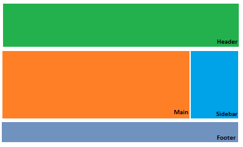
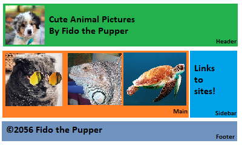

% Day 3 on HTML Semantics
% Sponsored by GOOGLE!

# Review

## Let's review

What did we talk about in the last class?

- What is the tool that we use for programming?
- Should we use spaces in our file names?

## All of the tags we learned.

- Tags
    - !DOCTYPE html head meta title body h1 h2 h3 h4 h5 h6 p img a ul ol li link
- Properties
    - class, id
- Ideas
    - CSS, The Box Model (content, padding, border, and margin)

## Let's code a fresh website from scratch.

Let's use http://jsfiddle.net to explore some of these items.

- Create a heading of size `h2`.
- Create an unordered list.
- Create a link to the Google website.

## Play the video on Passwords

. . .

What did you think?

## My take-aways

Here are my tips for passwords.

- Make them long.
- Make them random.
- Make them different.
- Store them in a password manager.
- Don't memorize your passwords.

## Password Managers

Pick one and store your passwords. Make sure they are all long, random, and different.

- bitwarden
- Last Pass
- 1password
- myki

## Finally, use 2FA.

- Lots of websites offer something called "Two Factor Authentication" or "2FA".
- This requires that you install a special authentication application (like **Authy**) to your phone.
- After you log into a website, the website will ask you to type in a code from the app on your phone.
- Turn this feature on for every website that offers 2FA.
    - Websites that offer 2FA: Google, Facebook, Instagram, Amazon, Twitch, and Twitter.
- 2FA is a second step to logging into a website, but it makes it harder for hackers to get in.

# Design Time

## Semantic Tags

Semantic tags are used to organize your content. Usually, websites are divided into areas:

- header information contains your sites title, the author name, and the logo.
- main content contains unique content like to show off to your visitors.
- sidebar content will contain a short description of the author and linkes to related websites.
- footer information copywrite information, contact information, a link back to the top of the page.
    - However, young people probably shouldn't put their contact information on a public website.

## Semantic Tags

HTML5 has semantic tags that represent each of these content areas:

- header area: `header`
- main content: `main`
- sidebar area: `aside`
- footer area: `footer`

These tags don't do anything special. All of these tags look the same and no one cares if you put the wrong content into a element. The purpose is to help you organize your website, so make sure the right content goes with the right tag. It's pretty easy to remember all of these except for "sidebar". You have to remember that "sidebar" is `aside`.

## Confusing Terminology: head vs header vs headings

- The `head` of the website contains information about the website, but no actual content. You usually see this before the `body` tag.
- The `header` of the website contains the information that people will see at the top of the page. You usually see this as one of the first elements inside the `body`.
- `h1, h2, h3, h4, h5, h6` are called **headings**. They are used to denote the tiles of sections of your website.

## Designing a website

When we design websites, we typically sketch up where these four primary elements will go.

## Designing a website

Next, we add example content to those basic areas.

## Design Time

- The best way to learn is to do.
- It's time to practice website design.
- Your task is to design a website in which you would like to design.
    - My favorite web design tool is just a pencil and paper.
    - If you don't want to draw, we encourage you to use Microsoft Paint.
    - Make sure you include the four areas: header, main, sidebar, and footer
    - Don't worry about what you can and cannot do.
        - Dream big. Put anything on your website.
        - If you think it should exist, try to make it exist.
- Spend some time drawing a website.
- If it helps, go find some images for your website.

# Coding Time

## Let's code the header section.

It's time to code your website. Follow along. Let's start with the `header` tag. Add this to your body. Obviously, you'll want to replace your page title and author with your name and title.

    <header>
        
        <ul>
            <li><h1>Cute Animal Pictures</h1></li>
            <li>By Fido the Pupper</li>
        </ul>
    </header>

## Let's code the main section.

Let's code the main section. I've got three images I'd like to display.

    <main>
        <h2>Check out this cool cat.</h2>
        
        
        <h2>Check out this adorable iguana.</h2>
        

        <h2>Check out this serious turtle.</h2>
        
    </main>

## Let's code our sidebar

    <aside>
        

           Learn more about animals at
           <a href="http://natgeo.com">
             National Geographic.
           </a>
        

    </aside>

This sidebar contains a link to another website.

## Let's code our footer.

The footer usually contains a copyright date.

    <footer>
        &copy; 2056 Fido the Pupper
    </footer>

# Creating a two column format.

## Change each section's color.

You can change each section of your website's color by naming the tag and changing the background color. Here, we change the background color of the `header` to red and the `main` to aqua. This code is added to `style.css`.

    header {
        background: gold;
    }

    main {
        background: aqua;
    }

Once you change these colors, change the `footer` and the `aside` to different colors.

## Centering Things

You can center anything in a container using this property.

    header {
        background: gold;
        text-align: center; /* Added Line */
    }

Based on the name, you'd think this only centers text, but really, it will center anything inside of the container. It's handy to remember.

## Controlling Width

Everything in HTML has a width. By default, all of our sections take up 100% of the screen. We can change this. Let's have `main` and `aside` take up less width.

    main {
        background: aqua;
        width: 50%;
    }

    aside {
        background: violet;
        width: 35%;
    }

Save your file and check out the results.

## Making the main move to the left.

We want the main to be on the left side of the screen and the sidebar to be on the right.
 
    main {
        background: aqua;
        width: 50%;
        float: left;
    }

Save your work and check it out. When elements float, elements below that element float too.

## Making the sidebar move to the right.

You guessed it: we can make the sidebar move to the right.

    aside {
        background: violet;
        width: 35%;
        float: right;
    }

Does this cause any problems? Check out the footer. Remember: when elements float, other elements below those elements float too.

## Let's move the footer.

The footer is in a weird spot. We need to move it back to the bottom of the page.

    footer {
        background: cornflowerblue;
        clear: both;
    }

The `clear` property tells elements to stop floating! It will move back to the bottom of the screen.

## Our page is looking ugly.

I think our images are too big. Let's reduce their size.

    #logo {
        width: 50%;
    }

    .animals {
        width: 80%;
    }

## Our page is (still) looking ugly.

Here's a trick. List these elements and separate them the comma to apply this padding.

    header, main, aside, footer {
        margin: 10px;
        padding: 10px;
        border-radius: 20px;
    }

# Rest of Class

## For the rest of class

For the rest of class, build your ideal website. Combine all of the elements we've covered in the past classes into a beautiful website. We'll be floating around the room to help you with your designs.

## Please keep your code

We'll be using this code for our projects for the rest of the week.
